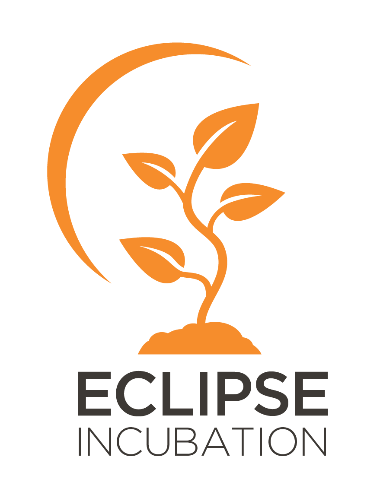

  

<h1 align="center">Eclipse aeriOS project</h1>

  <em>A Meta-Operating System to govern the Cloud–Edge–IoT Continuum</em>

  <!--  -->
  
  
  
  
  
  
  

<!-- ## 🌐 Overview -->

This project aims at fostering the future adoption of the **standard ISO/IEC JTC1/SC41 - Internet of things and digital twin** (currently on-going process, as preliminary working item). Eclipse aeriOS aligns with the formal architecture of a Meta Operating System for the Cloud-Edge-IoT computing continuum.

Eclipse aeriOS has been created from the results of the [aerOS](https://aeros-project.eu) Horizon Europe project (GA No. 101069732).

  

